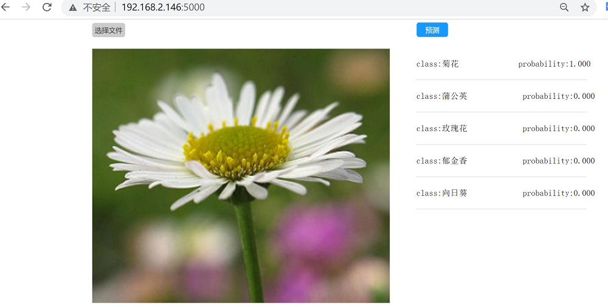
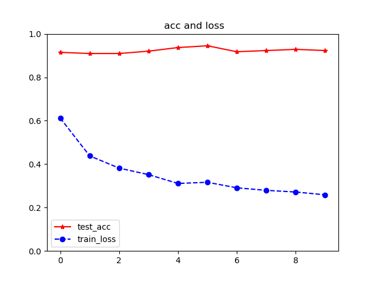

##  基于Flask的轻量图像分类web服务

fork from: [pytorch_flask_service](https://github.com/WZMIAOMIAO/deep-learning-for-image-processing/tree/master/deploying_service/deploying_pytorch/pytorch_flask_service) 

使用

+ 基于pytorch的mobileNet模型
+ flower photo数据集 
+ flask框架

### 1- 环境要求

```txt
flask==1.1.2
flask-cors==3.0.10
pillow==8.2.0
torchvision==0.8.0
```

## 2- 运行

直接运行需要训练好的模型权重`MobileNetV2.pt`  （[链接](https://pan.baidu.com/s/1sRfRO6dcfACWkmOj41b7JA )，ygpd）

启动服务

```python
python main.py
```

在浏览器端输入主机IP地址和端口号5000，例如：` 192.168.2.146:5000`，

点击`选择文件`，点击`预测`。



### 3- 重新训练模型

> 工具：
>
> + win10 anoconda
> + pytorch，cuda
> + Anoconda Prompt (anoconda)

**数据集** 

数据集：flower photo，该数据集在有3670张图片，共5个类别：菊花，蒲公英，向日葵，玫瑰花，郁金香。

下载链接：[Flower Photo](https://storage.googleapis.com/download.tensorflow.org/example_images/flower_photos.tgz)

将下载好的数据集解压，放在Dataset文件下。

`tree`: 

```
─Dataset
│  └─flower_data
│      ├─flower_photos
│      │  ├─daisy
│      │  ├─dandelion
│      │  ├─roses
│      │  ├─sunflowers
│      │  └─tulips
```

将数据集划分为训练集和验证集，比例为9 : 1

```python
python Dataset/split_data.py
```

**训练**

下载mobileNetV2的[预训练权重](https://download.pytorch.org/models/mobilenet_v2-b0353104.pth) 。改名为mobilenet_v2.pth，放在MobileNet文件夹里。

训练模型

```python
cd MobileNet
python train.py
```

> 6G显存，3-5分钟训练完毕。

**模型准确率**



### Reference

[1]	https://pytorch.org/tutorials/intermediate/flask_rest_api_tutorial.html

[2]	https://github.com/WZMIAOMIAO/deep-learning-for-image-processing/tree/master/deploying_service/deploying_pytorch/pytorch_flask_service


