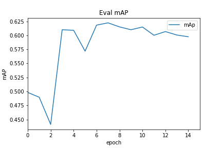
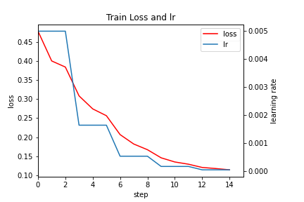
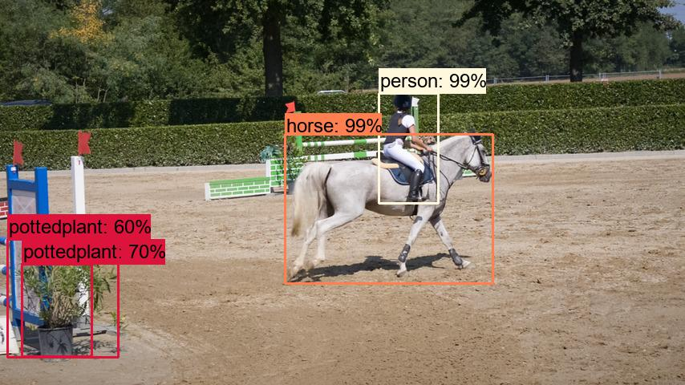

## Faster R-CNN

fork from: [faster_rcnn](https://github.com/WZMIAOMIAO/deep-learning-for-image-processing/tree/master/pytorch_object_detection/faster_rcnn) 

使用：

+ win + anoconda
+ anocaonda prompt

### 1-要求：

* python3.8
* pytorch1.7
* pycocotools

### 2-训练

**下载预训练权重**

骨干网络是带有FPN的resNet50，训练之前，先下载coco的[预训练权重]( https://download.pytorch.org/models/fasterrcnn_resnet50_fpn_coco-258fb6c6.pth) ，下载后，重命名为fasterrcnn_resnet50_fpn_coco.pth，并放入backbone文件夹中。

**数据集**

训练用的数据集是[PASCAL VOC2012](http://host.robots.ox.ac.uk/pascal/VOC/voc2012/VOCtrainval_11-May-2012.tar) ，下载后解压，放在主目录下。

然后划分训练集和测试集，默认比例`1:1` ，可以修改`val_rate`值来更改：

```python
python split_data.py
```

然后会自动在主目录生成`train.txt`和`val.txt`文件。

**训练**

根据GPU显存，修改文件`train_resnet50_fpn.py`中的batch size（默认为2），加载数据的线程个数默认为0（因为是在win平台）。

使用默认参数进行训练：

```python
python train_res50_fpn.py
```

**其它**

checkpoints默认为True，每一个epoch，自动保存一次模型（包括模型参数、优化器，学习率，epoch），如果中途中断了训练，则指定`resume`路径为中断时保存的模型路径（save_weights/xx.pth），执行`python train_res50_fpn.py`后，就会接着上次的继续训练。

+ 训练过程中，会自动保存loss，mAP这些信息在`results{"%Y%m%d-%H%M%S}.txt`文件中。

+ 训练结束后，会自动生成`mAP.png`和`loss_lr.png`。

+ 权重文件保存在save_weights文件夹。

在win10+6GB+batchsize=2下，训练过程中mAP变化图如下。



loss和学习率变化图如下。



### 3-测试

训练后的权重文件：model.pth，由于显存限制，训练出来的模型，mAP不是很高，所以使用了fork地址上的的[权重](https://pan.baidu.com/s/1ifilndFRtAV5RDZINSHj5w) (提取码:dsz8)。

将模型权重文件放在主目录。

**检测单张图片**

图片在主目录下，默认`test.jpg`

```python
python predict.py
```

检测结果为`result.jpg`，在主目录。

**批量检测图片**

将所有图片放在`Demo`文件夹里，执行：

```python
python predictImgs.py
```

检测结果会保存在IMG文件夹里。

如果Demo中的图片是从视频的帧，则将`predictImgs.py`文件中最后一行`frame2video("IMG")`取消注释，默认FPS=20，会自动将检测结果合成视频`out.mp4`。

**示例**



以上。